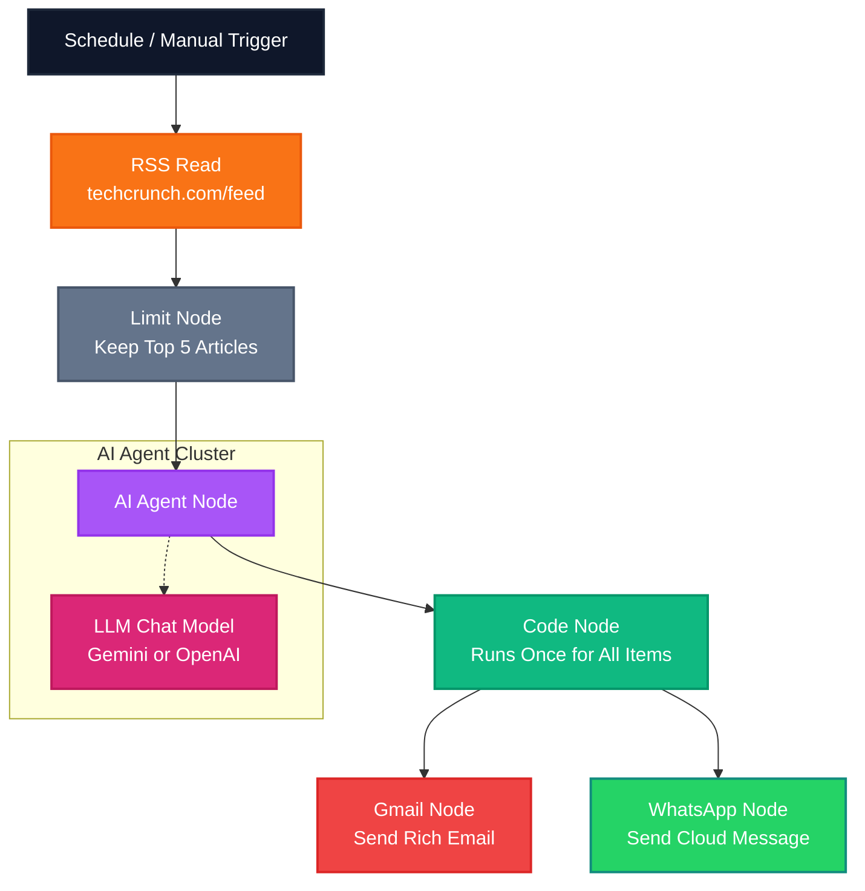

# ⚡ TechCrunch AI Digest Newsletter & WhatsApp Workflow for n8n

Welcome to your premium, automated, multi-channel **n8n** news summarizer! This workflow automatically scrapes articles from the **TechCrunch RSS Feed**, processes them in parallel using an **AI Agent** (powered by **Google Gemini** or **OpenAI**), and aggregates the summaries. It then delivers them simultaneously to **two channels**:
1. **Gmail**: A beautifully designed, premium HTML email newsletter digest.
2. **WhatsApp**: A clean, structured markdown notification text utilizing bolding, bullet points, and link emojis.

No inbox clutter, no individual chat spam—just one unified briefing summarizing the latest tech news.

---

## 🏗️ Workflow Architecture

---

## 🚀 Key Features

* **Multi-Channel Delivery**: Get a beautifully styled newsletter in your email inbox and a quick bulleted summary on your phone via WhatsApp simultaneously.
* **Smart Aggregation**: Standard n8n loops usually fire one notification per item. This workflow uses a **Code** node acting as a custom aggregator to bundle all articles into **one unified digest** for both channels.
* **Model Agnostic (Gemini & OpenAI)**: Configured with the latest **Google Gemini Chat Model** (`gemini-2.5-flash`) by default, but includes a pre-positioned, inactive **OpenAI Chat Model** node so you can switch models with a simple drag-and-drop.
* **API Cost Control**: The **Limit** node restricts processing to the latest 5 articles to prevent token exhaustion and keep notifications readable.

---

## 📥 How to Import the Workflow

1. Open your n8n workspace dashboard.
2. Click on the **Workflows** tab in the left-hand menu.
3. Click on the `...` menu in the top right corner and choose **Import from File**.
4. Select the [`techcrunch_summary_workflow.json`](./techcrunch_summary_workflow.json) file from this repository.
5. Alternatively, open [`techcrunch_summary_workflow.json`](./techcrunch_summary_workflow.json), copy the entire JSON content, return to your n8n canvas, and paste it using `Ctrl + V` (Windows) or `Cmd + V` (Mac).

---

## 🔑 Credential Configuration

Once imported, you need to configure credentials for the **LLM Model**, **Gmail**, and **WhatsApp** nodes.

### 1. Set Up Your AI Model (Gemini or OpenAI)
By default, the workflow uses the Google Gemini node. You can choose to stick with Gemini or switch to OpenAI:
* **Google Gemini (Default)**: Double-click the **Google Gemini Chat Model** node. Select **Create New Credential** and paste your API key from [Google AI Studio](https://aistudio.google.com/).
* **OpenAI (Alternative)**: Delete the connector link between the Gemini node and the AI Agent. Drag a line from the output of the **OpenAI Chat Model** node to the **Language Model** input port of the **AI Agent** node. Select **Create New Credential** and paste your API key from [OpenAI](https://platform.openai.com/).

---

### 2. Set Up Gmail OAuth2 Credentials
1. Double-click the **Gmail** node. Click **Create New Credential**.
2. Copy the **OAuth Redirect URL** provided by n8n.
3. Open the [Google Cloud Console](https://console.cloud.google.com/), create a project, and configure the OAuth Consent Screen (add your email as a test user).
4. Click **Create Credentials** → **OAuth client ID** → **Web application**. Add the n8n Redirect URL under **Authorized redirect URIs**.
5. Copy the generated **Client ID** and **Client Secret**, paste them into n8n, click **Sign in with Google**, and authorize.

---

### 3. Set Up WhatsApp Business Cloud Integration
The **WhatsApp Business Cloud** node uses Meta's official Cloud API. Follow these brief steps to connect it to n8n:

#### Step A: Create a Meta Developer App
1. Go to the [Meta for Developers Portal](https://developers.facebook.com/) and register as a developer.
2. Click **My Apps** → **Create App**. Select **Other** → **Business** as the app type.
3. Name your app and link it to your Meta Business Account.

#### Step B: Add WhatsApp to Your App
1. On your app dashboard, scroll down to **WhatsApp** and click **Set up**.
2. Meta will automatically assign a free test phone number to your account.
3. Under the **Step 1: Send and receive messages** section, add your personal phone number as a verified recipient (since you are in sandbox mode, you can only send to verified numbers).
4. Copy the following credentials from the Meta dashboard:
   * **Temporary Access Token** (Note: A permanent token can be generated in your Business Manager settings).
   * **Phone Number ID** (This is a 15-digit number, *not* the actual phone number).
   * **WhatsApp Business Account ID**.

#### Step C: Configure the Node in n8n
1. Double-click the **WhatsApp Business Cloud** node in n8n.
2. Under **Credential for WhatsApp Business Cloud API**, click **Create New Credential** and paste your Meta **Access Token** and **Business Account ID**.
3. In the node settings:
   * Paste your **Phone Number ID** into the corresponding field.
   * In the **To** field, type your personal phone number including the country code (e.g., `+11234567890`).

---

## 🎯 Testing & Verification

1. Click the **Execute Workflow** button at the bottom of your n8n canvas.
2. Watch the execution visually trace through the nodes:
   * **RSS Read** pulls the TechCrunch articles.
   * **Limit** narrows them down to the top 5.
   * **AI Agent** generates parallel 2-sentence summaries.
   * **Code** aggregates and outputs both the styled HTML string and the WhatsApp markdown string.
   * **Gmail** sends the newsletter digest to your inbox.
   * **WhatsApp Business Cloud** sends a bulleted summary directly to your mobile phone!
