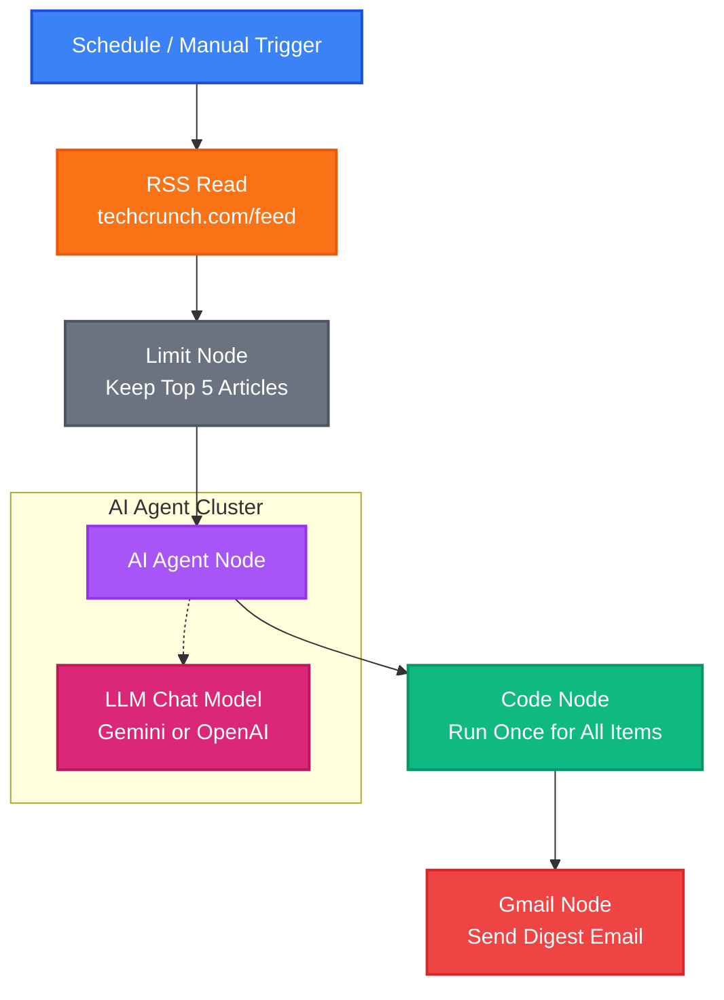

# Implementation Plan - n8n News Summary Workflow

This plan outlines the design and structure for an automated **n8n** workflow that reads articles from the TechCrunch RSS feed, utilizes an AI Agent (powered by Large Language Models like Google Gemini or OpenAI) to summarize them, compiles them into a premium HTML newsletter digest, and sends the digest to your inbox via Gmail.

To ensure a seamless experience, we will provide the complete n8n workflow as a importable JSON file along with a detailed setup guide.

## Key Design Principles
1. **Aggregated Digest vs. Spam**: Instead of sending an email for every single article (which leads to inbox clutter), the workflow processes articles in parallel and aggregates them into a single, cohesive, premium HTML newsletter.
2. **Cost & Rate Control**: A **Limit** node is included to process the top 5 articles. This prevents excessive API consumption and keeps the digest clean and readable.
3. **Advanced AI Integration**: Uses n8n's standard **AI Agent** node, which is model-agnostic and can be powered by either **Google Gemini** (recommended) or **OpenAI Chat Model**.
4. **Rich Aesthetics**: The generated HTML newsletter will feature a premium, responsive layout with modern typography (Inter), subtle gradients, and card-based article styling.

---

## Workflow Diagram

---

## Proposed Files

We will create two main files in the workspace:

### 1. [NEW] [techcrunch_summary_workflow.json](file:///c:/Users/HP/Desktop/shiv/programming%20project/Git_hub%20project/n8n%20news%20summary%20workflow/techcrunch_summary_workflow.json)
The full n8n workflow definition in JSON format. It includes:
* **Manual & Schedule Triggers**: Enables running the workflow instantly or scheduling it (e.g., daily at 9:00 AM).
* **RSS Read Node**: Configured with `https://techcrunch.com/feed` to retrieve article details (title, description, URL, and publish date).
* **Limit Node**: Restricts processing to the latest 5 entries.
* **AI Agent & LLM Chat Model Nodes**: Configured with instructions to summarize each article into 2 clear sentences. We will supply standard configurations for both **Google Gemini** and **OpenAI** in the documentation, defaulting to Gemini/OpenAI in the JSON.
* **Aggregator Code Node**: An advanced JavaScript block that runs *once for all items*, matches each AI-generated summary back to its original title and link, and outputs a highly styled HTML newsletter.
* **Gmail Node**: Fully mapped with expressions to send the HTML output of the Code node as a rich email.

### 2. [NEW] [README.md](file:///c:/Users/HP/Desktop/shiv/programming%20project/Git_hub%20project/n8n%20news%20summary%20workflow/README.md)
A comprehensive setup guide that walks you through:
* How to import the workflow JSON.
* Setting up your Google Gemini or OpenAI API credentials in n8n.
* Creating and authenticating Gmail OAuth2 credentials in n8n.
* How to configure, run, and activate the workflow.

---

## Verification Plan

### Manual Verification
1. Import the generated JSON file into a local or cloud instance of n8n.
2. Verify that all nodes are correctly placed and connected exactly as specified in the workflow schema.
3. Test credentials setup and model integration.
4. Execute the workflow manually and confirm that it generates a single beautifully formatted email with concise summaries of the top 5 TechCrunch articles.
